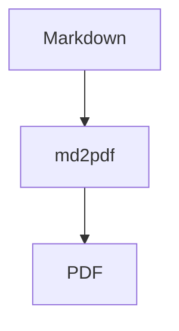

# サンプルドキュメント

これはmd2pdfの動作確認用サンプルです。

## 機能

- Markdown から PDF への変換
- 日本語フォント対応
- Mermaid ダイアグラム対応
- 目次の自動生成

## Mermaid ダイアグラムの例



## コードブロック

```python
def hello():
    print("Hello, World!")
```

## 表

| 項目 | 説明 |
|------|------|
| 入力 | Markdown ファイル |
| 出力 | PDF ファイル |
| 対応言語 | 日本語、英語、中国語 |

## まとめ

このツールを使うと、Markdownファイルを簡単にPDFに変換できます。
